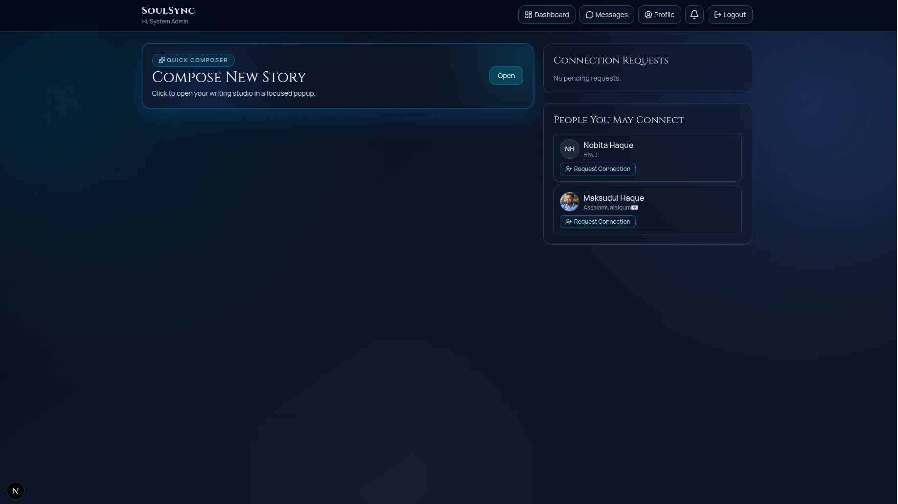

# SoulSync

<div align="center">
  
</div>

A full-stack social platform focused on expressive posting, meaningful connections, real-time conversations, and admin-level moderation.

## Live Demo

- Production URL: https://soul-sync-navy.vercel.app/

## Overview

SoulSync is built with Next.js App Router and provides:

- JWT-based authentication with NextAuth credentials provider
- Rich social feed with reactions, comments, sharing, and media uploads
- Connection workflows (request, accept, reject, remove, block)
- Direct messaging with unread counters and conversation summaries
- Profile management and public profile pages
- Admin dashboard with advanced moderation controls

The project is designed for Vercel deployment and uses MongoDB for persistence.

## Tech Stack

### Frontend

- Next.js 16 (App Router)
- React 19
- Tailwind CSS 4
- Framer Motion
- Lucide Icons
- TipTap editor
- React Hook Form + Zod
- React Hot Toast

### Backend

- Next.js Route Handlers
- NextAuth v4 (Credentials, JWT sessions)
- Mongoose + MongoDB
- Zod request validation

### Uploads

- Vercel Blob in production
- Local fallback to public/uploads in non-Vercel environments

## Core Features

### Authentication

- Email/password registration and login
- Session strategy: JWT
- Server-side auth guards in API routes and pages
- Automatic admin bootstrap utility

### Feed and Posts

- Rich text composer
- Image and PDF attachments
- Text style customization
- Reactions and comments
- Share interactions
- Post visibility control (including admin moderation)

### Social Graph

- Connection request flow
- Accept/reject/remove connections
- User block support
- Suggested users

### Messaging

- Direct 1:1 conversations
- Text + voice messages
- Read/unread tracking
- Conversation summary endpoint

### Profiles

- Private profile management
- Public profile view by user id
- Profile posts listing
- Admin can moderate posts directly from public profile pages

### Admin Control Center

- Dashboard analytics
- User role management
- Block/unblock users
- Time-based posting restrictions
- View a selected user's posts
- Hide/unhide/delete posts
- User deletion with related cleanup safeguards

## Project Structure

```text
src/
  app/
    admin/
    api/
      admin/
      auth/
      connection/
      conversations/
      messages/
      notifications/
      posts/
      profile/
      upload/
    feed/
    messages/
    profile/
  components/
  lib/
  models/
  types/
public/
  uploads/
```

## Data Models

### User

Includes identity and profile fields, social graph fields, and moderation fields:

- role: user | admin
- isBlocked, blockReason, blockedAt
- postRestrictionUntil, postRestrictionReason
- connections, pendingSent, pendingReceived, blockedUsers

### Post

- author reference
- content and textStyle
- media attachments
- reactions and comments
- isHidden moderation flag

### Message

- from, to
- text and optional voiceUrl
- read status

### Notification

- per-user notifications for activity and system events

## API Surface (High-Level)

### Auth

- POST /api/auth/register
- POST /api/auth/forgot-password
- POST /api/auth/reset-password
- NextAuth handler at /api/auth/[...nextauth]

### Admin

- GET /api/admin/overview
- PATCH, DELETE /api/admin/users/[id]
- GET /api/admin/users/[id]/posts
- PATCH, DELETE /api/admin/posts/[id]

### Social

- POST /api/connection/request
- POST /api/connection/accept
- POST /api/connection/reject
- POST /api/connection/remove
- POST /api/connection/block

### Feed and Content

- GET, POST /api/posts
- PATCH, DELETE /api/posts/[id]
- POST /api/posts/[id]/react
- POST /api/posts/[id]/comment

### Profile

- GET, PUT /api/profile
- GET /api/profile/posts

### Messaging and Notifications

- GET, POST /api/messages
- GET /api/conversations
- GET, PATCH /api/notifications

### Upload

- POST /api/upload

## Environment Variables

Create a .env.local file with:

```bash
MONGODB_URI=your_mongodb_connection_string
NEXTAUTH_SECRET=your_nextauth_secret
NEXTAUTH_URL=http://localhost:3000
BLOB_READ_WRITE_TOKEN=your_vercel_blob_token
SMTP_HOST=your_smtp_host
SMTP_PORT=587
SMTP_USER=your_smtp_username
SMTP_PASS=your_smtp_password
SMTP_FROM="SoulSync <no-reply@yoursite.com>"
```

Notes:

- BLOB_READ_WRITE_TOKEN is required for uploads on Vercel.
- NEXTAUTH_URL should match your deployed domain in production.
- SMTP variables are required to deliver password reset emails.

## Local Development

### 1) Install dependencies

```bash
npm install
```

### 2) Configure environment variables

Add the required variables in .env.local.

### 3) Start development server

```bash
npm run dev
```

Open http://localhost:3000

## Scripts

- npm run dev: start development server
- npm run build: create production build
- npm run start: run production server
- npm run lint: run ESLint

## Build and Quality Checks

Recommended before every deployment:

```bash
npm run lint
npm run build
```

## Deployment on Vercel

1. Import this repository into Vercel
2. Set all required environment variables in Project Settings
3. Deploy from main branch
4. Confirm production logs and route health

If uploads fail in production, verify BLOB_READ_WRITE_TOKEN first.

## Security and Admin Notes

The system includes an auto-created admin account utility in src/lib/admin.ts.

Important:

- Update default admin credentials immediately for production use
- Keep NEXTAUTH_SECRET strong and private
- Restrict database and Blob credentials to server-side only

## Operational Notes

- Mongo connection uses a global cached connection strategy for server runtime stability.
- Uploads fall back to local disk only outside Vercel when Blob token is unavailable.
- Admin moderation changes are reflected through protected server endpoints.

## Known Good Deployment Baseline

The project has been validated with:

- Successful ESLint checks
- Successful Next.js production build
- Functional admin dashboard routes and moderation APIs

## License

No explicit license file is currently defined in this repository.
